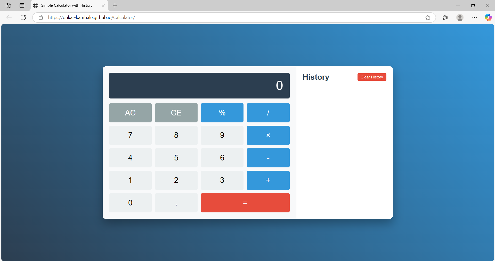

# Calculator
A simple and responsive calculator web application built using HTML, CSS, and JavaScript.

# 📄 Project Structure
-index.html - Contains the structure of the calculator.
-styles.css - Handles the design and layout of the calculator.
-script.js - Implements the functionality and logic behind the calculator.

# 🚀 Features
-Basic arithmetic operations (Addition, Subtraction, Multiplication, Division)
-Responsive design
-Clear and easy-to-use interface
-Supports History Saving using Local Storage
-Delete Single History Items
-Clear Full History

# 📷 Screenshot

# 🛠️ How to Run
1. Clone the repository:
   git clone https://github.com/Onkar-Kambale/Calculator.git
2. Open the index.html file in your web browser.

# 📚 Technologies Used
-HTML5
-CSS3
-JavaScript (Vanilla)
